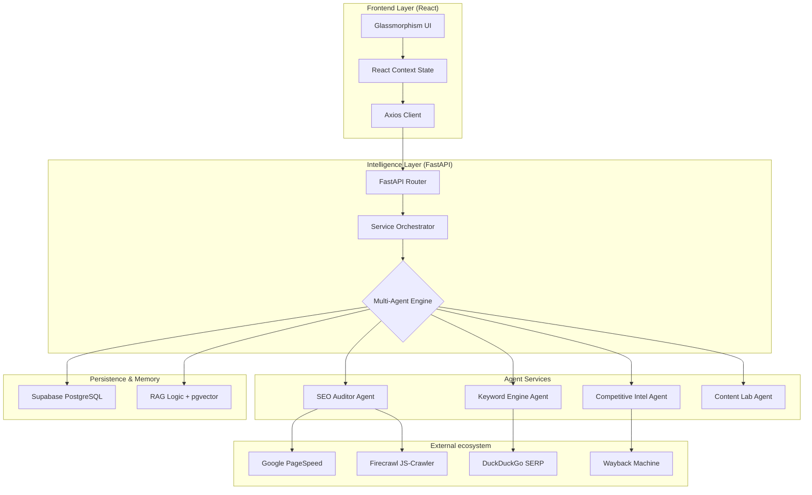

# 🤖 SAEO.ai - Autonomous Intelligence Engine

SAEO.ai is a production-grade, multi-agent SEO and AEO (Answer Engine Optimization) platform. It leverages autonomous agents and a suite of high-performance APIs to provide deep technical audits, competitor intelligence, and strategic visibility tracking.

---

## 🏗️ System Architecture

The project is split into two primary components:

### 1. 🚀 Backend (FastAPI + Asynchronous Agents)
- **FastAPI**: High-performance, asynchronous web framework.
- **Multi-Agent Logic**: Custom agents for SEO auditing, keyword discovery, and competitor analysis.
- **RAG Engine (Supabase + Vector Store)**: Contextual memory for audits using pgvector and e5-large-v2 embeddings.
- **Comprehensive API Suite**: Integrated with PageSpeed, Wayback Machine, GSC/GA4, and DuckDuckGo.

### 2. 🎨 Frontend (React + Vite + Tailwind)
- **Modern UI/UX**: Premium dashboard with glassmorphism and motion-optimized interactions.
- **Complex Visualizations**: Recharts for performance and visibility trend analysis.
- **Unified Navigation**: Single sidebar layout for seamless tool transition.

---

## 🏗️ Complete Project Architecture

The platform follows a decoupled, agent-orchestrated architecture. The frontend communicates with a set of specialized service agents via a high-performance API.



---

## ️ API & Technology Ecosystem

Our platform is powered by a hybrid of Premium and Open-Source/Free tools:

| Category | Integration | Purpose | Cost Model |
| :--- | :--- | :--- | :--- |
| **Intelligence** | **OpenAI / Gemini** | Strategic reasoning & content analysis | Premium |
| **Scraping** | **Firecrawl** | Deep JS rendering & site crawling | Premium |
| **Memory** | **Supabase (pgvector)**| Persistent vector storage for RAG | Free Tier |
| **Performance**| **PageSpeed Insights**| Core Web Vitals (LCP, CLS, FCP) | Free Tier |
| **Search Data** | **Google Search Console**| Official click & impression data | Free |
| **History** | **Wayback Machine** | Historical domain tracking & age | Free |
| **SERP** | **DuckDuckGo Proxy** | Real-time search rankings | Free |
| **Embeddings** | **Hugging Face** | Local vector generation (e5-large-v2) | Free |

---

## 🚦 Quick Start

### Prerequisites
- Python 3.9+ | Node.js 18+
- Required Keys: OpenAI, Hugging Face, Supabase, PageSpeed, Firecrawl.

### 1. Backend Setup
```bash
cd backend
pip install -r requirements.txt
python main.py
```

### 2. Frontend Setup
```bash
cd frontend
npm install
npm run dev
```

---

## 🧠 Core Methodology

### Answer Engine Optimization (AEO)
SAEO.ai maps entity relationships and citation clusters to ensure your site is the preferred source for conversational AI like ChatGPT, Claude, and Gemini.

### Contextual RAG Audits
Every site audit is vectorized and stored in **Supabase**. Subsequent audits retrieve historical findings to identify "Technical Drift"—persistent issues that manual audits often miss.
