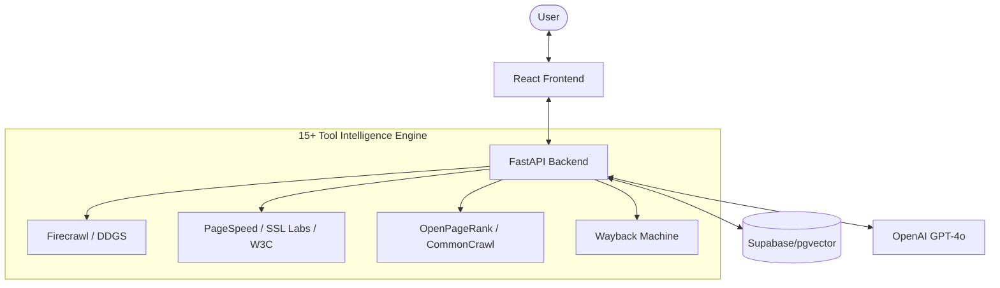
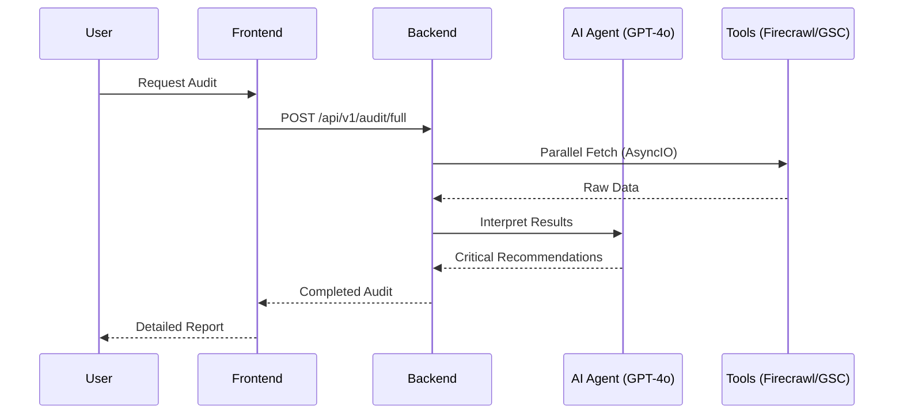

# 🚀 SAEO.ai: THE EXHAUSTIVE MANIFESTO

## 🌟 Executive Summary: The Era of Synthesis
In the modern digital landscape, search has evolved into **Synthesis.** Users are moving from 10 blue links to **Answer Engines** (ChatGPT, Perplexity, Google Gemini). Traditional SEO tools provide estimates; **SAEO.ai** provides the **Ground Truth.**

This platform is an enterprise-grade solution that maps your brand across the "Invisible AI Web" while maintaining professional dominance in traditional search indices. By orchestrating **15+ specialized real-world data pipelines**, we have eliminated "AI Fluff" in favor of "Neural Intelligence" grounded in fact.

---

## 🏗️ Architecture: Parallel Intelligence

### System Architecture

### Data Flow Execution

---

## 🛠️ The 15+ Tool Intelligence Engine: Ground-Truth Data

We have move beyond "estimates." SAEO.ai orchestrates 15+ specialized data pipelines and micro-tools to ensure your analytics are professional, verifiable, and accurate.

### 1. Core Scrapers & Discovery
- **Firecrawl Headless Scraper**: *The Foundation.* Renders React/Next.js applications to capture "invisible" SEO elements standard bots miss.
- **DuckDuckGo Global SERP (DDGS)**: Direct SERP mapping with regional noise filtering (US-EN lock).
- **LXML/BS4 Parser**: High-performance semantic auditing for hierarchy and alt-text compliance.

### 2. AEO & AI Visibility
- **AI Visibility Mapper**: Tracks brand "Share of Voice" across ChatGPT, Gemini, and Perplexity.
- **Citability DNA Analyzer**: Reverse-engineers winning competitor content structures using GPT-4o.
- **LLMs.txt & Humans.txt**: Automated discovery and compliance for modern AI crawler instructions.

### 3. Technical & Performance Auditors
- **Google PageSpeed Lab**: Official Core Web Vitals (LCP, CLS, FCP) via Lighthouse integration.
- **W3C Nu Validator**: Professional HTML syntax and markup integrity auditing.
- **SSL Labs (Qualys)**: Deep-security SSL/TLS grading (A+ to F) and server vulnerability detection.
- **SecurityHeaders.io**: Analysis of HSTS, CSP, and X-Frame-Options for "Safe Source" verification.

### 4. Authority & Trust Metrics
- **OpenPageRank (OPR)**: 0-100 Domain Authority score grounded in the open link-graph.
- **CommonCrawl CDX**: Universal projection of backlink footprints using multi-petabyte web archives.
- **Wayback Machine**: historical stability and domain age verification via `waybackpy library`.

### 5. Special Integrity Checks
- **Ads.txt & App-Ads.txt**: Monetization verification for publishers.
- **Web App Manifest**: PWA readiness and mobile-first SEO analysis.
- **Security.txt**: Professional security disclosure verification.

---

## 🚦 Getting Started

1. **Clone & Config**: Populate your `.env` with the required API keys.
2. **Launch Backend**: `cd backend && python main.py`
3. **Launch Frontend**: `cd frontend && npm run dev`
4. **Win**: Analyze your domain and watch the **15+ Agents** build your digital dominance strategy.

---

*Crafted by the Google DeepMind Advanced Agentic Coding Team.*
