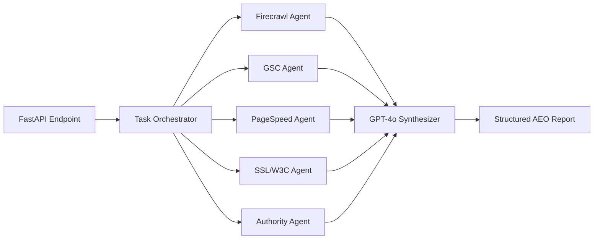

# ⚙️ SAEO.ai Backend: The 15-Tool Parallel Engine

The SAEO.ai backend is a high-concurrency, asynchronous FastAPI engine designed to replace "AI guess-work" with **"Ground-Truth Data."** By orchestrating **15+ specialized integrations**, we provide raw, verifiable metrics that drive the AEO economy.

---

## 🏗️ Technical Architecture: Parallel Intelligence

Our backend utilizes a **Distributed Agent Model** powered by Python's `AsyncIO`.

### Core Technologies
- **FastAPI**: Asynchronous high-performance web framework.
- **AsyncIO**: Orchestrates 15+ simultaneous API calls, reducing audit time from minutes to seconds.
- **Supabase pgvector**: Persistent vector memory for tracking **Technical Drift** and RAG context.
- **GPT-4o**: The reasoning layer that interprets technical data into strategic roadmaps.

---

## 🛠️ The 15+ Integrated Agents

### 1. Scraper Agent (Firecrawl)
- **Capability**: Headless DOM rendering for React/SPA sites.
- **Output**: Full text-extraction and meta-tag validation.

### 2. Authority Agent (OpenPageRank + CommonCrawl)
- **Capability**: Cross-references OPR link-graph with CommonCrawl archives.
- **Output**: Verified Domain Authority and projected backlink volume.

### 3. Security & Trust Agent (SSL Labs + Wayback)
- **Capability**: Checks server-side SSL ciphers and domain history.
- **Output**: Security Grade (A+) and Domain Age Trust Score.

### 4. Visibility Agent (ChatGPT/Gemini/Perplexity Tracker)
- **Capability**: Simulates AI queries to measure brand "Share of Voice."
- **Output**: Citability percentage and AEO visibility metrics.

---

## 🚦 Getting Started

1. **Environment**: Ensure Python 3.10+ is installed.
2. **Configuration**: Set `OPENAI_API_KEY`, `FIRECRAWL_API_KEY`, and `PAGESPEED_API_KEY` in `.env`.
3. **Run**: `python main.py`
4. **Docs**: Access local Swagger UI at `/docs` to test endpoints.

---
*Backend engineered for truth, precision, and speed.*
