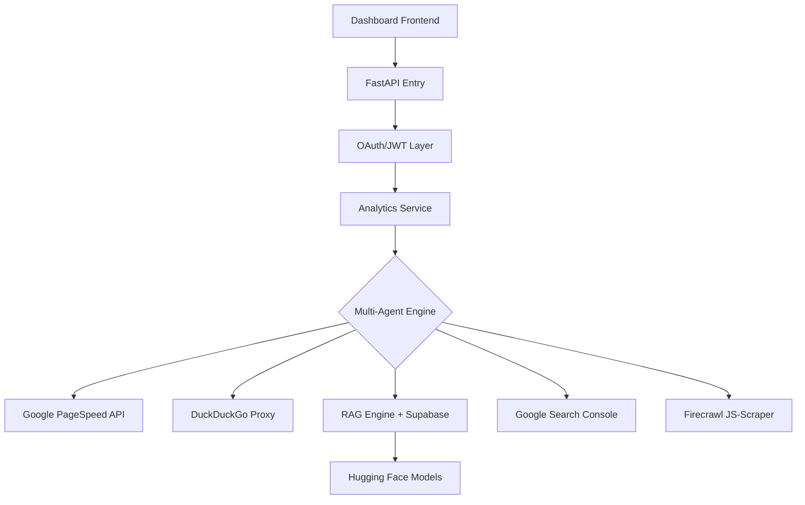

# 🚀 SAEO.ai Backend - Autonomous SEO Engine

This is the core intelligence layer of the SAEO.ai platform. It is built as a high-performance, asynchronous FastAPI application that orchestrates multi-agent workflows to deliver professional-grade SEO and AEO insights.

---

## 🛠️ Integrated API Ecosystem

We have integrated 8+ external tools to provide a "full-stack" SEO analysis that rivals industry leaders.

### 💎 Premium AI & Scraping
- **OpenAI (GPT-4o) / Google Gemini**: Used for strategic reasoning, competitor deconstruction, and fixing technical issues.
- **Firecrawl**: Advanced site crawler that handles JavaScript-heavy applications (React/Next.js) and extracts clean markdown for AI processing.

### ⚡ Free & Open-Source Tools
- **DuckDuckGo SERP Proxy**: Fetches real-time search results for keyword and competitor tracking without expensive third-party fees.
- **Wayback Machine**: Retrieves historical domain data to calculate domain age and authority growth patterns.
- **Google PageSpeed Insights**: Real-time Core Web Vitals (LCP, CLS, FCP) directly from Google's performance lab.
- **Hugging Face (e5-large-v2)**: Local embedding model used to vectorize site data for RAG memory without sending sensitive data to external servers.

### 📊 Official Search Connectors
- **Google Search Console**: Direct integration for clicks, impressions, and indexing status.
- **Google Analytics 4**: Real-time user metrics and engagement sessions.

---

## 🧠 Core Features & Architecture

### 1. RAG-Augmented SEO Audits (The "Memory" Layer)
We implement a **Retrieval-Augmented Generation (RAG)** system using **Supabase (pgvector)**. 
Every audit is vectorized. When you run a new audit, the backend retrieves previous findings to identify "Technical Drift"—recognizing which issues have been fixed and which are persistent blockers.

### 2. Multi-Agent Service Logic
Logic is separated into specialized service agents:
- `seo_auditor.py`: Detailed technical checks + Firecrawl integration.
- `external_apis.py`: Master connector for PageSpeed, Wayback, and DDG.
- `keyword_engine.py`: AI-powered cluster mapping and intent analysis.
- `rag_engine.py`: Vector search and context injection logic.

### 3. Proprietary Detectors
Custom logic was built for:
- **Tech Stack Discovery**: Pattern-matching signatures for CMS (WordPress/Shopify), CDNs (Cloudflare/Fastly), and Frameworks.
- **Security Auditor**: Automated weighted scoring for HSTS, CSP, and X-Frame-Options.

---

## 🏗️ Architecture Flow



---

## 🚦 Getting Started

1. **Environment Config**:
   Populate `.env` with required API keys (OpenAI, Supabase, Firecrawl, etc.).
2. **Install Dependencies**:
   ```bash
   pip install -r requirements.txt
   ```
3. **Launch Engine**:
   ```bash
   python main.py
   ```
