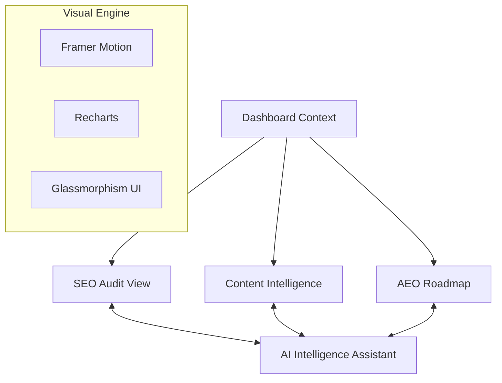
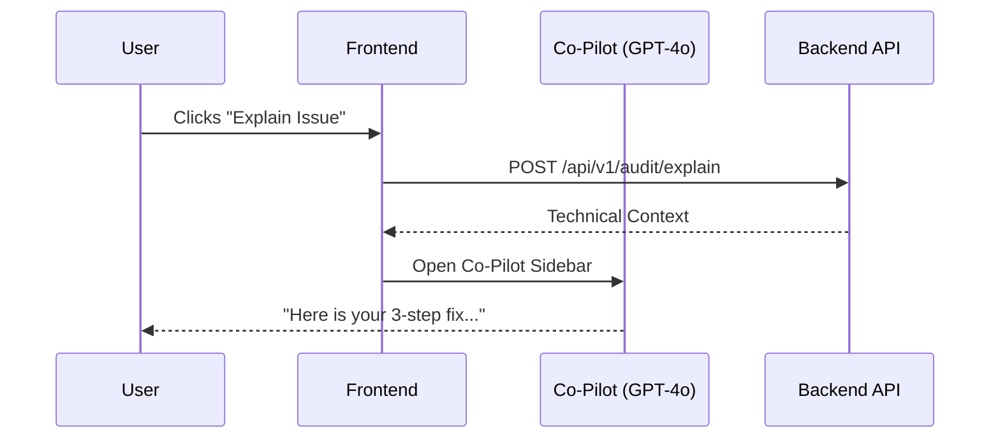

# 🎨 SAEO.ai Frontend: Premium AEO Intelligence

The SAEO.ai frontend is a state-of-the-art React dashboard designed to visualize the outputs of our **15-tool backend engine**. We bridge the gap between complex technical data and executive decision-making.

---

## 🏗️ UI Architecture & Data Flow

### Interaction Sequence

---

## 💎 Premium Features

### 🤖 1. SAEO Co-Pilot (Intelligence Assistant)
A persistent AI sidekick that knows your history. Powered by the platform's **RAG Memory**, it answers questions specifically about your site's previous audits and visibility trends.

### 📊 2. High-Density Data Visualization
Utilizing **Recharts** and **Framer Motion**, we provide interactive visualizations of:
- **Stability Index**: Your overall technical health.
- **Share of Voice**: Brand dominance in AI answer engines.
- **Core Web Vitals**: Real-time performance metrics.

### 🛡️ 3. The "Deep Audit" Interface
Technical audits clearly display:
- **SSL Grades (A+)** from SSL Labs.
- **Markup Errors** from the W3C Validator.
- **Crawl Status** from the Firecrawl Stealth Engine.

---

## 🛠️ Technology Stack

| Feature | Technology |
| :--- | :--- |
| **Framework** | React 18 / Vite / TypeScript |
| **Styling** | Tailwind CSS (Glassmorphism + Dark Mode) |
| **Animation** | Framer Motion (State-driven transitions) |
| **State** | React Context (Global Dashboard Sync) |
| **API Client** | Axios (Centralized Utility with Auth Interceptors) |

---

## 🚦 Getting Started

1. **Install**: `npm install`
2. **Launch**: `npm run dev`
3. **Analyze**: Enter a URL and watch the **15-Agent system** build your dashboard in seconds.

---
*Frontend designed to WOW and inform.*
